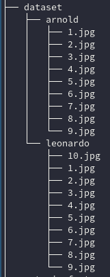

# Métodos de visão computacional para segurança em vídeos 
Este pacote contém dois exemplos de visão computacional apresentados em uma palestra na Fatec de Araras, em 23/10/2019.

Os seguintes pacotes são requisitos mínimos para que os exemplos sejam executados:

> Python 3.5 ou superior  
> Opencv 4

O opencv pode ser instalado via `pip` com o seguinte comando:

	pip install opencv-python

As recomendações para execução estão descritas abaixo:

## Reconhecimento facial
O exemplo de visão computacional é separado em três partes:

1. Extração das features de um banco de dados de rostos;
2. Treinamento da SVM para classificação com as features extraídas no passo 1;
3. Execução da leitura do feed da câmera e reconhecimento de rostos.

Entre na pasta do exemplo

	cd reconhecimento/facial

Instale os requisitos extras necessários para execução deste exemplo com o comando:

	pip install -r requirements.txt

### Extração das features

Primeiramente é necessária a formulação de um banco de imagens na pasta `reconhecimento-facial/dataset`. Neste banco de dados, cada subpasta será uma categoria (onde `nome_subpasta = nome_categoria`) e o nome das fotos dentro destas subpastas é irrelevante. A imagem abaixo demonstra um banco de dados que será reconhecido pelo programa:

Com o banco de dados criado, execute o seguinte comando para executar a extração das features:
	
	python extrair_features.py

Este programa irá produzir o arquivo `output/embeddings.pickle` que contém a lista, com as features e as classes de cada uma das fotos, serializada com o [pickle](https://docs.python.org/3/library/pickle.html).

### Treinamento do modelo

Após a extração das features, podemos executar o treinamento da SVM com o comando

	python treinar_modelo.py

Este procedimento criará dois arquivos:

- `output/le.pickle`: Contém as labels codificadas do treinamento;
- `output/recognizer.pickle`: Armazena o modelo treinado da SVM.

### Execução do exemplo

Agora podemos verificar o resultado no feed da câmera com o comando

	python reconhecer_video.py

Para concluir o programa, aperte a tecla `q` na janela da filmagem.

Este exemplo foi adaptado [deste](https://www.pyimagesearch.com/2018/09/24/opencv-face-recognition/) post. Para maiores detalhes sobre cada uma das etapas, por favor, verifique o original.

## Detecção de anomalias

Entre na pasta do exemplo
	
	cd deteccao-anomalias

Execute o exemplo com MOG para o feed da câmera com o comando

	python MOG.py
